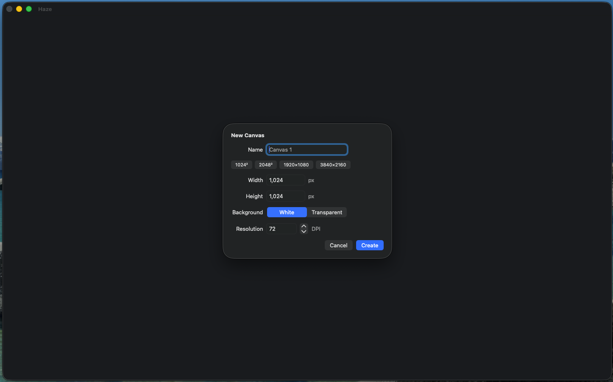
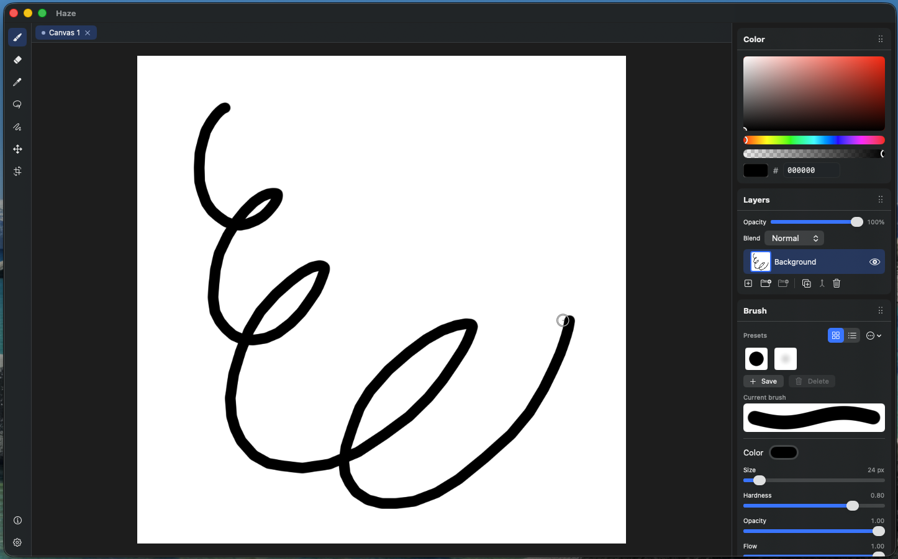
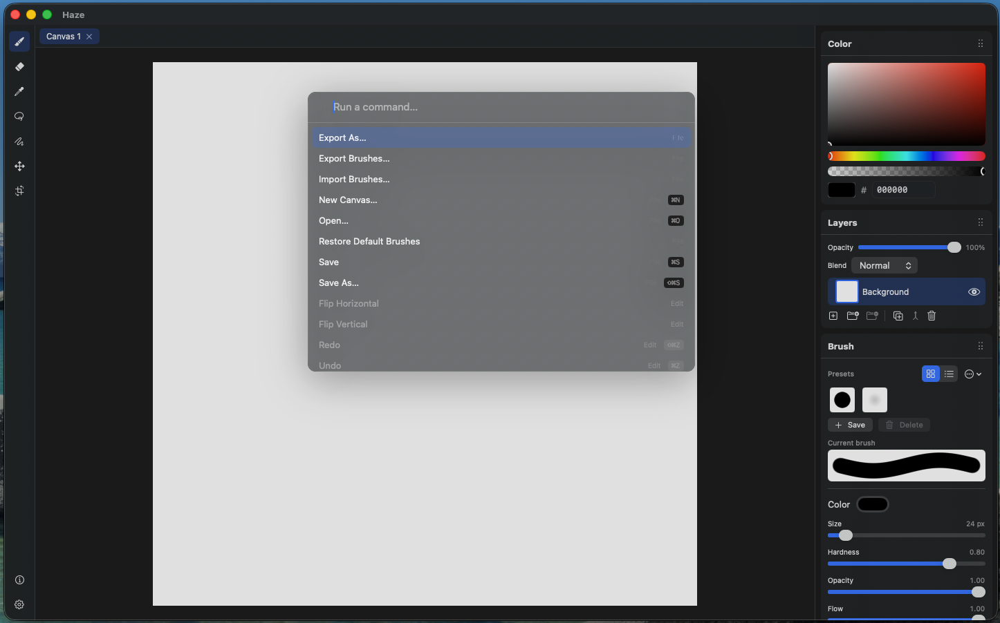

# Canvas & workflow

## New canvas

**File ▸ New** (`⌘N`) opens a dialog for size (with presets), background (white or transparent), and resolution (DPI). New canvases are 8-bit sRGB.

Haze edits **one canvas at a time** in this build. Opening or creating another canvas first prompts to save the current one (if it has unsaved changes), then replaces it. Closing a canvas leaves an empty editor.

> Editing multiple documents at once is in progress.

## Canvas edits

- **Resize Canvas…** (`⌘⌥C`) - crop / extend at an anchor, or resample (bilinear).
- **Flip Canvas Horizontally / Vertically** (Image menu) - mirrors the entire canvas.

## Panels

Reorderable panels: **Color**, **Brush**, **Layers**, and an **Info** popover (bottom left corner). Visibility is toggled from the **Window** menu (checkmark = visible); drag panels to reorder them in the dock.

## Command palette & shortcuts

The **Command Palette** (`⌘⇧P`) is the fastest way to find and run any command. Start typing and it searches all actions in the app by title and keywords; press Return to run the top match. It's the same registry the menu bar is generated from, so anything in the menus will also be in there. Commands that aren't applicable in the moment (for example, a layer action with no layer selected) stay listed but greyed out.

**Keyboard shortcuts** are configurable in **Settings** (`⌘,`) → Keyboard Shortcuts, with a recorder, reset, and conflict reassignment. 

Tool defaults: 
- Brush `B`
- Eraser `E`,
- Eyedropper `I`
- Lasso `L`
- Polygon Lasso `⇧L`
- Move `V`
- Transform `⌘T`

## Zoom & pan

Trackpad **pinch to zoom** (anchored at the cursor), **two-finger pan**, and
**double-tap to fit**.

## Diagnostics & privacy

Haze runs entirely on your Mac - **no network, no telemetry**. Local logs and any crash info are written to a folder you can reach via **Help ▸ Reveal Diagnostics in Finder**; attach the most recent file when filing a bug. This info is not sent anywhere automatically. 
