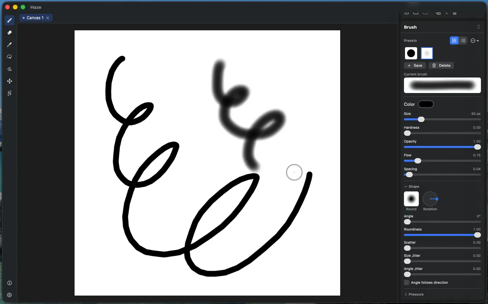

# Brushes & painting

Haze's brush engine is GPU-accelerated with support for pressure-sensitive tablets. Painting deposits brushstrokes onto the active layer with undo capabilities.

## Tools

- **Brush** (`B`) - paint with the current brush and foreground color
  - Brush size steps down / up with **`[`** and **`]`** 
- **Eraser** (`E`) - same engine in destination-out mode
- **Eyedropper** (`I`) - sample the composited color under the cursor into the shared foreground color; you can also hold **Option** with the brush tool selected to sample without switching tools

## Dynamics

Pen pressure can drive three independent responses set in the Brush panel's **Pressure** section:

- **→ Size** - pressure scales the footprint
- **→ Flow** - pressure scales per-dab deposit (build-up within a stroke)
- **→ Opacity** - pressure sets a per-stroke opacity *ceiling*: overlapping dabs within one stroke don't build past the pressure-set level

Core brush parameters: **size**, **hardness**, **spacing**, **opacity**, and **flow** (per-dab deposit rate).

## Tips & shape

Beyond the soft round tip, Haze includes some textured tips - **Chalk**, **Spatter**, and **Square** - selectable from the Brush panel's tip picker. Shape controls apply to textured tips:

- **Angle** and a rotation dial, plus **Angle follows direction**
- **Roundness** - squashes the minor axis for calligraphic strokes
- **Scatter** - spreads dabs perpendicular to the stroke
- **Size jitter** and **Angle jitter** - randomize per dab

> Importing your own PNG/JPEG brush tips is in progress.

## Presets

The top of the Brush panel is the brush presets sub-panel:

- **Save** the current brush as a new preset, **delete**, **rename** (double-click)
- Presets store **shape + dynamics only**

## Color

Painting uses the shared foreground color (8-bit sRGB) - see [Color](3-color.md).
