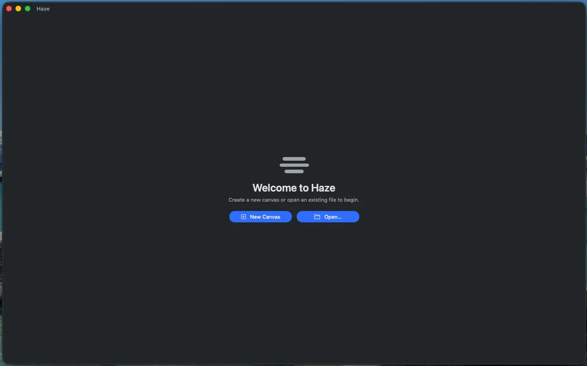

# Haze documentation

Documentation that covers the current behavior and features in the Haze Demo (**v0.1.0**).

> **Requires macOS 14 (Sonoma) or later on an Apple silicon Mac (M1 or later).**
> Intel Macs are not supported. See the main [README](../README.md) for download + install.

- [Canvas & workflow](1-canvas-workflow.md) - new canvas, resize, flip, panels, command palette, shortcuts, zoom/pan, and diagnostics
- [Brushes & painting](2-brushes.md) - the brush engine, tips, dynamics, presets, eraser
- [Color](3-color.md) - the HSV picker, hex, swatches, eyedropper, and the shared foreground color
- [Layers & groups](4-layers.md) - the layer tree, opacity/visibility, blend modes, Merge Down
- [Selections & transform](5-selections-and-transform.md) - lasso/polygon, boolean modifiers, Move, and free transform
- [Files & formats](6-files.md) - PSD / PNG / JPEG open, save, and export, plus what happens to 16-bit / Display P3 documents on import

> Haze is an early alpha. Behavior and file formats may change between builds - keep backups, and see the main [README](../README.md) for install and feedback details.
